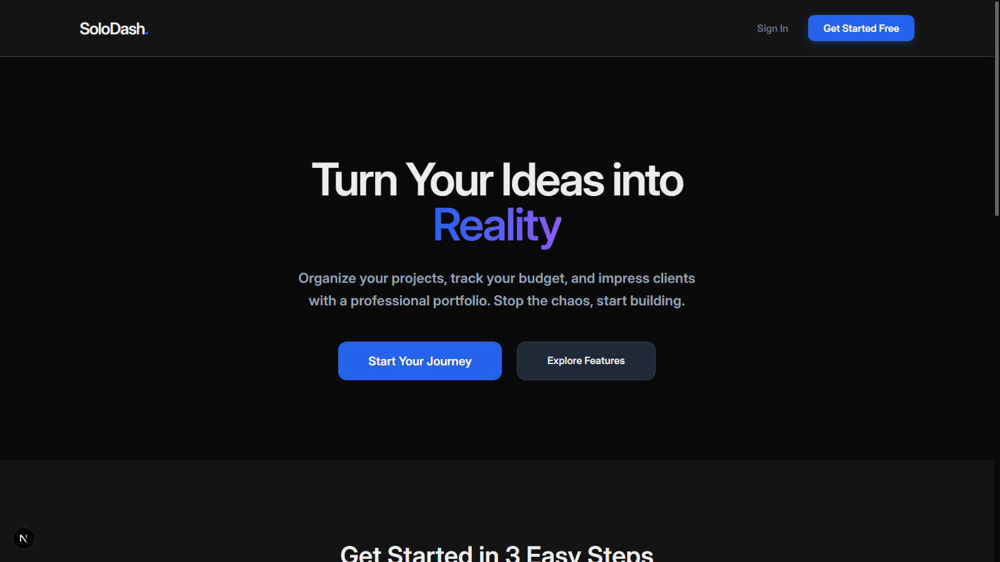
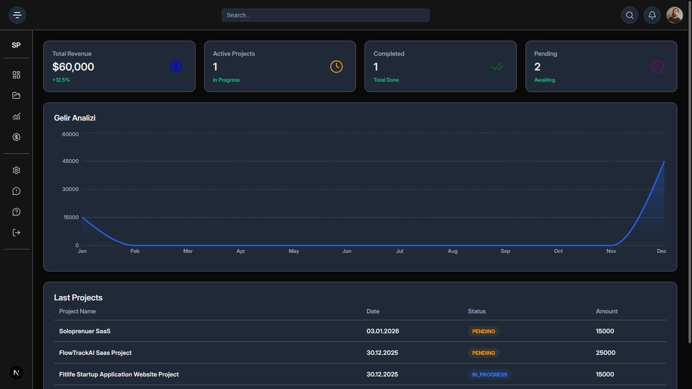
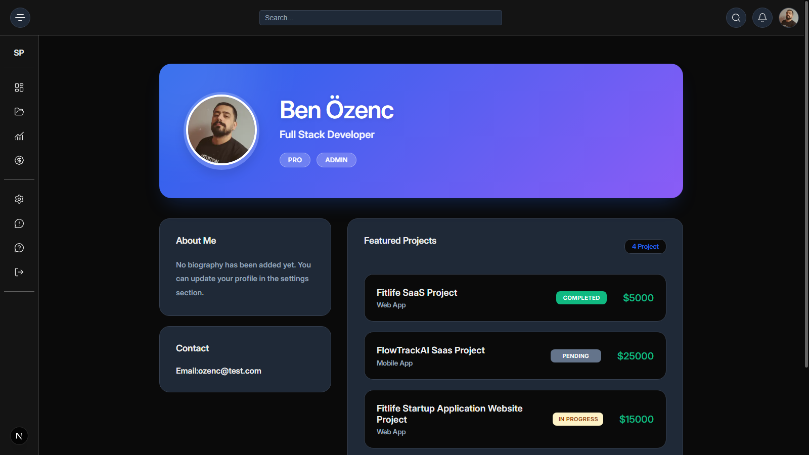
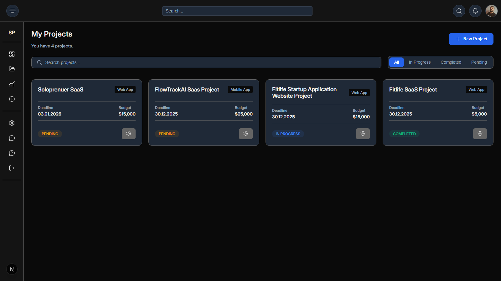

# 🚀 SoloDash - Full Stack Solopreneur Workspace

SoloDash is a specialized management dashboard and portfolio tool built for independent developers and freelancers to manage their business and showcase their work in one place.

---

## 🌍 Language Options / Dil Seçenekleri

- [English](#-english-summary)
- [Türkçe](#-türkçe-özet)

---

## 🇺🇸 English Summary

### 🎯 The Problem

Freelancers often struggle with managing multiple projects across different platforms and lack a professional way to showcase their active/completed work to potential clients instantly.

### 💡 The Solution

SoloDash provides a central hub where users can track project statuses, manage budgets, and maintain a public-facing professional profile.

### ✅ Key Features

- **Full Stack Auth:** Secure JWT-based authentication system.
- **Project Tracking:** CRUD operations for managing freelance projects with budget and status details.
- **Dynamic Portfolio:** A professional public profile page that updates automatically based on your project list.
- **Image Management:** Avatar and asset uploads via Cloudinary.
- **Performance Optimized:** 90+ Lighthouse scores with Next.js 14 optimization.

### 🛠 Tech Stack

- **Frontend:** Next.js 14 (App Router), CSS Modules, TypeScript.
- **Backend:** Node.js, Express.js.
- **Database:** PostgreSQL with Prisma ORM.
- **Authentication:** JSON Web Tokens (JWT) & Bcrypt.
- **Storage:** Cloudinary API.

---

## 🇹🇷 Türkçe Özet

### 🎯 Sorun

Freelancerlar genellikle projelerini farklı platformlarda takip etmekte zorlanıyor ve potansiyel müşterilerine bitirdikleri işleri anında sunabilecekleri profesyonel bir portfolyo aracına ihtiyaç duyuyorlar.

### 💡 Çözüm

SoloDash, kullanıcıların proje durumlarını takip edebileceği, bütçelerini yönetebileceği ve dışarıya açık profesyonel bir profil oluşturabileceği merkezi bir çalışma alanı sunar.

### ✅ Temel Özellikler

- **Full Stack Auth:** JWT tabanlı güvenli giriş ve kayıt sistemi.
- **Proje Takibi:** Bütçe ve durum detaylarıyla birlikte proje yönetim paneli.
- **Dinamik Portfolyo:** Proje listenize göre otomatik güncellenen profesyonel profil sayfası.
- **Resim Yönetimi:** Cloudinary entegrasyonu ile profil fotoğrafı yükleme.
- **Performans:** Next.js 14 optimizasyonları ile 90+ Lighthouse puanı.

### 🛠 Kullanılan Teknolojiler

- **Frontend:** Next.js 14, TypeScript, CSS Modules.
- **Backend:** Node.js, Express.js.
- **Veritabanı:** PostgreSQL (Prisma ORM).
- **Güvenlik:** JWT, Bcrypt.
- **Depolama:** Cloudinary.

---

## 🛠 Roadmap / Future Plans

- [ ] **Financial Analytics:** Visual charts for monthly revenue and budget tracking.
- [ ] **Project Edit UI:** Advanced interfaces for modifying existing project details.
- [ ] **Stripe Integration:** Subscription model for PRO features.

---

## 📸 Screenshots

_(Add your project images here)_

- **Landing Page:** ``
- **User Dashboard:** ``
- **Professional Profile:** ``
- **Projects:** ``

---

# 🚀 SoloDash - Full Stack Solopreneur Workspace

SoloDash is a specialized management dashboard and portfolio tool built for independent developers and freelancers to manage their business and showcase their work in one place.

---

## 🌍 Language Options / Dil Seçenekleri
- [English](#-english-summary)
- [Türkçe](#-türkçe-özet)

---

## 🇺🇸 English Summary

### 🎯 The Problem
Freelancers often struggle with managing multiple projects across different platforms and lack a professional way to showcase their active/completed work to potential clients instantly.

### 💡 The Solution
SoloDash provides a central hub where users can track project statuses, manage budgets, and maintain a public-facing professional profile.

### ✅ Key Features
- **Full Stack Auth:** Secure JWT-based authentication system.
- **Project Tracking:** CRUD operations for managing freelance projects with budget and status details.
- **Dynamic Portfolio:** A professional public profile page that updates automatically based on your project list.
- **Image Management:** Avatar and asset uploads via Cloudinary.
- **Performance Optimized:** 90+ Lighthouse scores targeted with Next.js 14 optimization.

### 🛠 Tech Stack
- **Frontend:** Next.js 14 (App Router), CSS Modules, TypeScript.
- **Backend:** Node.js, Express.js.
- **Database:** PostgreSQL with Prisma ORM.
- **Authentication:** JSON Web Tokens (JWT) & Bcrypt.
- **Storage:** Cloudinary API.

---

## 🇹🇷 Türkçe Özet

### 🎯 Sorun
Freelancerlar genellikle projelerini farklı platformlarda takip etmekte zorlanıyor ve potansiyel müşterilerine bitirdikleri işleri anında sunabilecekleri profesyonel bir portfolyo aracına ihtiyaç duyuyorlar.

### 💡 Çözüm
SoloDash, kullanıcıların proje durumlarını takip edebileceği, bütçelerini yönetebileceği ve dışarıya açık profesyonel bir profil oluşturabileceği merkezi bir çalışma alanı sunar.

### ✅ Temel Özellikler
- **Full Stack Auth:** JWT tabanlı güvenli giriş ve kayıt sistemi.
- **Proje Takibi:** Bütçe ve durum detaylarıyla birlikte proje yönetim paneli.
- **Dinamik Portfolyo:** Proje listenize göre otomatik güncellenen profesyonel profil sayfası.
- **Resim Yönetimi:** Cloudinary entegrasyonu ile profil fotoğrafı yükleme.
- **Performans:** Next.js 14 optimizasyonları ile yüksek Lighthouse puanı hedefi.

---

## 🛠 Roadmap / Future Plans
- [ ] **Financial Analytics:** Visual charts for monthly revenue and budget tracking.
- [ ] **Project Edit UI:** Advanced interfaces for modifying existing project details.
- [ ] **Stripe Integration:** Subscription model for PRO features.

---

## 📸 Screenshots
- **Landing Page:** 
- **User Dashboard:** 
- **Professional Profile:** 
- **Projects:** 

---

## 🚀 Getting Started

To run this project locally, follow these steps:

### 1. Clone the Repo
```bash
git clone [https://github.com/ozzencben/SoloDash---Full-Stack-Solopreneur-Workspace](https://github.com/ozzencben/SoloDash---Full-Stack-Solopreneur-Workspace.git)
cd solodash

cd server
npm install
# Create a .env file and add your DATABASE_URL, JWT_SECRET, CLOUDINARY keys
npm run dev

cd client
npm install
# Create a .env.local file and add your NEXT_PUBLIC_API_URL
npm run dev